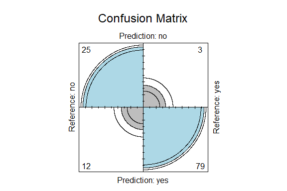
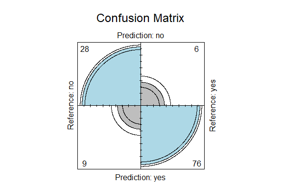

Business Intelligence Project
================
<Specify your name here>
<Specify the date when you submitted the lab>

- [Student Details](#student-details)
- [Setup Chunk](#setup-chunk)
- [Load and split the dataset](#load-and-split-the-dataset)
- [Test data split of the dataset](#test-data-split-of-the-dataset)

# Student Details

|                                            |                                    |
|--------------------------------------------|------------------------------------|
| *Student ID Number*                        | 135129,122147,120578,121774,121619 |
| *Student Name*                             | Avengers                           |
| *BBIT 4.2 Group*                           | B                                  |
| *BI Project Group Name/ID (if applicable)* | Avengers                           |

# Setup Chunk

*Note:* the following KnitR options have been set as the global
defaults: <BR> knitr::opts_chunk\$set(echo = TRUE, warning = FALSE, eval
= TRUE, collapse = FALSE, tidy = TRUE).

More KnitR options are documented here
<https://bookdown.org/yihui/rmarkdown-cookbook/chunk-options.html> and
here <https://yihui.org/knitr/options/>.

{r setup, include=FALSE} library(formatR) knitr::opts_chunk\$set(
warning = FALSE, collapse = FALSE )

# Load and split the dataset

``` r
library(AER)
```

    ## Warning: package 'AER' was built under R version 4.3.2

    ## Loading required package: car

    ## Warning: package 'car' was built under R version 4.3.2

    ## Loading required package: carData

    ## Warning: package 'carData' was built under R version 4.3.2

    ## Loading required package: lmtest

    ## Loading required package: zoo

    ## 
    ## Attaching package: 'zoo'

    ## The following objects are masked from 'package:base':
    ## 
    ##     as.Date, as.Date.numeric

    ## Loading required package: sandwich

    ## Warning: package 'sandwich' was built under R version 4.3.2

    ## Loading required package: survival

``` r
data("Affairs")
```

# Test data split of the dataset

``` r
library(caret)
```

    ## Loading required package: ggplot2

    ## Loading required package: lattice

    ## 
    ## Attaching package: 'caret'

    ## The following object is masked from 'package:survival':
    ## 
    ##     cluster

``` r
train_index <- createDataPartition(Affairs$age,
                                   p = 0.8,
                                   list = FALSE)
affairs_train <- Affairs[train_index, ]
affairs_test <- Affairs[-train_index, ]
```

Train the model

``` r
set.seed(7)
train_control <- trainControl(method = "cv", number = 5)
affairs_caret_model_lm <- train(age ~ ., data = affairs_train,
                                       method = "lm", metric = "RMSE",
                                       preProcess = c("center", "scale"),
                                       trControl = train_control)
```

Display the model’s details

``` r
print(affairs_caret_model_lm)
```

    ## Linear Regression 
    ## 
    ## 482 samples
    ##   8 predictor
    ## 
    ## Pre-processing: centered (8), scaled (8) 
    ## Resampling: Cross-Validated (5 fold) 
    ## Summary of sample sizes: 387, 384, 386, 386, 385 
    ## Resampling results:
    ## 
    ##   RMSE      Rsquared   MAE     
    ##   5.594542  0.6344089  4.178982
    ## 
    ## Tuning parameter 'intercept' was held constant at a value of TRUE

Make predictions

``` r
predictions <- predict(affairs_caret_model_lm,
                       affairs_test[, 1:9])
```

Display the model’s evaluation metrics

``` r
rmse <- sqrt(mean((affairs_test$age - predictions)^2))
print(paste("RMSE =", sprintf(rmse, fmt = "%#.4f")))
```

    ## [1] "RMSE = 5.9628"

SSR

``` r
ssr <- sum((affairs_test$age - predictions)^2)
print(paste("SSR =", sprintf(ssr, fmt = "%#.4f")))
```

    ## [1] "SSR = 4231.0404"

SST

``` r
sst <- sum((affairs_test$age - mean(affairs_test$age))^2)
print(paste("SST =", sprintf(sst, fmt = "%#.4f")))
```

    ## [1] "SST = 10577.4328"

R Squared

``` r
r_squared <- 1 - (ssr / sst)
print(paste("R Squared =", sprintf(r_squared, fmt = "%#.4f")))
```

    ## [1] "R Squared = 0.6000"

MAE

``` r
absolute_errors <- abs(predictions - affairs_test$age)
mae <- mean(absolute_errors)
print(paste("MAE =", sprintf(mae, fmt = "%#.4f")))
```

    ## [1] "MAE = 4.4967"

Logistic Regression

Train the model

``` r
affairs_model_glm <- glm(children ~ ., data = affairs_train,
                          family = binomial(link = "logit"))
```

Display the model’s details

``` r
print(affairs_model_glm)
```

    ## 
    ## Call:  glm(formula = children ~ ., family = binomial(link = "logit"), 
    ##     data = affairs_train)
    ## 
    ## Coefficients:
    ##   (Intercept)        affairs     gendermale            age   yearsmarried  
    ##      0.325446       0.001948       0.735210       0.002923       0.323511  
    ## religiousness      education     occupation         rating  
    ##      0.025640       0.014467      -0.351597      -0.149793  
    ## 
    ## Degrees of Freedom: 481 Total (i.e. Null);  473 Residual
    ## Null Deviance:       569.8 
    ## Residual Deviance: 378.7     AIC: 396.7

Make predictions

``` r
probabilities <- predict(affairs_model_glm, affairs_test[, 1:9],
                         type = "response")
print(probabilities)
```

    ##        44        47       115       129       151       170       187       194 
    ## 0.5140695 0.9929977 0.2060042 0.8342909 0.9769071 0.5063810 0.3835144 0.4601385 
    ##       249       277       295       299       324       355       361       366 
    ## 0.9751067 0.9877120 0.8881958 0.9471230 0.6433541 0.8896390 0.9415744 0.1770635 
    ##       381       382       412       416       422       439       448       478 
    ## 0.9890134 0.9765254 0.2841133 0.3232607 0.5126524 0.9574336 0.9901944 0.9205883 
    ##       482       491       515       517       535       538       631       671 
    ## 0.9153506 0.9841552 0.1901557 0.9743923 0.8037596 0.9765086 0.3663109 0.9902263 
    ##       706       717       737       798       800       803       812       830 
    ## 0.9503340 0.9823609 0.4416779 0.9906370 0.9950819 0.9737447 0.9457629 0.3655730 
    ##       848       863       905       910       916       931       965       987 
    ## 0.9512679 0.6351065 0.9913293 0.2637598 0.7105994 0.5006586 0.3041692 0.2890871 
    ##      1009      1027      1039      1063      1068      1072      1084      1086 
    ## 0.8050457 0.3982173 0.6460155 0.2445326 0.6297985 0.9561256 0.9771796 0.5656180 
    ##      1124      1143      1166      1221      1226      1229      1242      1245 
    ## 0.8876214 0.7032226 0.9862467 0.9759813 0.9908412 0.6625990 0.5286843 0.7380845 
    ##      1276      1298      1299      1305      1328      1332      1333      1384 
    ## 0.9834039 0.3782799 0.9848884 0.7714973 0.3747675 0.6393029 0.4582160 0.4370736 
    ##      1407      1423      1439      1452      1481      1513      1621      1638 
    ## 0.4761846 0.6425980 0.7081102 0.8056105 0.2084051 0.9553130 0.2013119 0.9800113 
    ##      1670      1723      1726      1761      1773      1854      1897      1899 
    ## 0.2738377 0.1510462 0.2150430 0.9831685 0.2828268 0.9742265 0.6849378 0.9896491 
    ##      1916      1920      1947      1949      9023         6        79       122 
    ## 0.9626305 0.7917657 0.8805482 0.2637598 0.9817858 0.4906143 0.5075551 0.9865120 
    ##       133       174       275       369       432       513       516       526 
    ## 0.9741258 0.9824755 0.7347227 0.9750830 0.9911002 0.5753557 0.7865760 0.9939343 
    ##       553       755       770       834       933       968      1011      1080 
    ## 0.7119366 0.6200765 0.9766348 0.9435167 0.6874731 0.7814083 0.9109458 0.8047625 
    ##      1163      1622      1751      1831      1929      1938      9010 
    ## 0.7516728 0.7904583 0.5901186 0.9853760 0.9450324 0.5888617 0.9884846

``` r
predictions <- ifelse(probabilities > 0.5, "pos", "neg")
print(predictions)
```

    ##    44    47   115   129   151   170   187   194   249   277   295   299   324 
    ## "pos" "pos" "neg" "pos" "pos" "pos" "neg" "neg" "pos" "pos" "pos" "pos" "pos" 
    ##   355   361   366   381   382   412   416   422   439   448   478   482   491 
    ## "pos" "pos" "neg" "pos" "pos" "neg" "neg" "pos" "pos" "pos" "pos" "pos" "pos" 
    ##   515   517   535   538   631   671   706   717   737   798   800   803   812 
    ## "neg" "pos" "pos" "pos" "neg" "pos" "pos" "pos" "neg" "pos" "pos" "pos" "pos" 
    ##   830   848   863   905   910   916   931   965   987  1009  1027  1039  1063 
    ## "neg" "pos" "pos" "pos" "neg" "pos" "pos" "neg" "neg" "pos" "neg" "pos" "neg" 
    ##  1068  1072  1084  1086  1124  1143  1166  1221  1226  1229  1242  1245  1276 
    ## "pos" "pos" "pos" "pos" "pos" "pos" "pos" "pos" "pos" "pos" "pos" "pos" "pos" 
    ##  1298  1299  1305  1328  1332  1333  1384  1407  1423  1439  1452  1481  1513 
    ## "neg" "pos" "pos" "neg" "pos" "neg" "neg" "neg" "pos" "pos" "pos" "neg" "pos" 
    ##  1621  1638  1670  1723  1726  1761  1773  1854  1897  1899  1916  1920  1947 
    ## "neg" "pos" "neg" "neg" "neg" "pos" "neg" "pos" "pos" "pos" "pos" "pos" "pos" 
    ##  1949  9023     6    79   122   133   174   275   369   432   513   516   526 
    ## "neg" "pos" "neg" "pos" "pos" "pos" "pos" "pos" "pos" "pos" "pos" "pos" "pos" 
    ##   553   755   770   834   933   968  1011  1080  1163  1622  1751  1831  1929 
    ## "pos" "pos" "pos" "pos" "pos" "pos" "pos" "pos" "pos" "pos" "pos" "pos" "pos" 
    ##  1938  9010 
    ## "pos" "pos"

Display the model’s evaluation metrics

``` r
table(predictions, affairs_test$children)
```

    ##            
    ## predictions no yes
    ##         neg 25   3
    ##         pos 12  79

Logistic Regression with caret

``` r
train_control_reg <- trainControl(method = "cv", number = 5)
set.seed(7)
affairs_caret_model_logistic <-
  train(children ~ ., data = affairs_train,
        method = "regLogistic", metric = "Accuracy",
        preProcess = c("center", "scale"), trControl = train_control)
print(affairs_caret_model_logistic)
```

    ## Regularized Logistic Regression 
    ## 
    ## 482 samples
    ##   8 predictor
    ##   2 classes: 'no', 'yes' 
    ## 
    ## Pre-processing: centered (8), scaled (8) 
    ## Resampling: Cross-Validated (5 fold) 
    ## Summary of sample sizes: 387, 385, 385, 386, 385 
    ## Resampling results across tuning parameters:
    ## 
    ##   cost  loss       epsilon  Accuracy   Kappa    
    ##   0.5   L1         0.001    0.8215979  0.5450221
    ##   0.5   L1         0.010    0.8215979  0.5450221
    ##   0.5   L1         0.100    0.8153475  0.5265209
    ##   0.5   L2_dual    0.001    0.8153479  0.5210754
    ##   0.5   L2_dual    0.010    0.8153479  0.5210754
    ##   0.5   L2_dual    0.100    0.8153479  0.5210754
    ##   0.5   L2_primal  0.001    0.8153479  0.5210754
    ##   0.5   L2_primal  0.010    0.8153479  0.5210754
    ##   0.5   L2_primal  0.100    0.8153479  0.5210754
    ##   1.0   L1         0.001    0.8237032  0.5489013
    ##   1.0   L1         0.010    0.8216413  0.5424108
    ##   1.0   L1         0.100    0.8236813  0.5402181
    ##   1.0   L2_dual    0.001    0.8153694  0.5215745
    ##   1.0   L2_dual    0.010    0.8153694  0.5215745
    ##   1.0   L2_dual    0.100    0.8132861  0.5171225
    ##   1.0   L2_primal  0.001    0.8153694  0.5215745
    ##   1.0   L2_primal  0.010    0.8153694  0.5215745
    ##   1.0   L2_primal  0.100    0.8153479  0.5210754
    ##   2.0   L1         0.001    0.8154343  0.5258668
    ##   2.0   L1         0.010    0.8154343  0.5258668
    ##   2.0   L1         0.100    0.8194931  0.5313169
    ##   2.0   L2_dual    0.001    0.8153694  0.5215745
    ##   2.0   L2_dual    0.010    0.8153694  0.5215745
    ##   2.0   L2_dual    0.100    0.8153694  0.5215745
    ##   2.0   L2_primal  0.001    0.8153694  0.5215745
    ##   2.0   L2_primal  0.010    0.8153694  0.5215745
    ##   2.0   L2_primal  0.100    0.8153694  0.5215745
    ## 
    ## Accuracy was used to select the optimal model using the largest value.
    ## The final values used for the model were cost = 1, loss = L1 and epsilon
    ##  = 0.001.

Make predictions

``` r
predictions <- predict(affairs_caret_model_logistic,
                       affairs_test[, 1:9])
```

Display the model’s evaluation metrics

``` r
confusion_matrix <-
  caret::confusionMatrix(predictions,
                         affairs_test[, 1:9]$children)
print(confusion_matrix)
```

    ## Confusion Matrix and Statistics
    ## 
    ##           Reference
    ## Prediction no yes
    ##        no  25   3
    ##        yes 12  79
    ##                                           
    ##                Accuracy : 0.8739          
    ##                  95% CI : (0.8006, 0.9277)
    ##     No Information Rate : 0.6891          
    ##     P-Value [Acc > NIR] : 2.216e-06       
    ##                                           
    ##                   Kappa : 0.6848          
    ##                                           
    ##  Mcnemar's Test P-Value : 0.03887         
    ##                                           
    ##             Sensitivity : 0.6757          
    ##             Specificity : 0.9634          
    ##          Pos Pred Value : 0.8929          
    ##          Neg Pred Value : 0.8681          
    ##              Prevalence : 0.3109          
    ##          Detection Rate : 0.2101          
    ##    Detection Prevalence : 0.2353          
    ##       Balanced Accuracy : 0.8195          
    ##                                           
    ##        'Positive' Class : no              
    ## 

``` r
fourfoldplot(as.table(confusion_matrix), color = c("grey", "lightblue"),
             main = "Confusion Matrix")
```

<!-- -->

Linear Discriminant Analysis with caret

Train the model

``` r
set.seed(7)
train_control <- trainControl(method = "LOOCV")
affairs_caret_model_lda <- train(children ~ .,
                                  data = affairs_train,
                                  method = "lda", metric = "Accuracy",
                                  preProcess = c("center", "scale"),
                                  trControl = train_control)
print(affairs_caret_model_lda)
```

    ## Linear Discriminant Analysis 
    ## 
    ## 482 samples
    ##   8 predictor
    ##   2 classes: 'no', 'yes' 
    ## 
    ## Pre-processing: centered (8), scaled (8) 
    ## Resampling: Leave-One-Out Cross-Validation 
    ## Summary of sample sizes: 481, 481, 481, 481, 481, 481, ... 
    ## Resampling results:
    ## 
    ##   Accuracy   Kappa    
    ##   0.8112033  0.5242424

Make predictions

``` r
predictions <- predict(affairs_caret_model_lda,
                       affairs_test[, 1:9])
```

Display the model’s evaluation metrics

``` r
confusion_matrix <-
  caret::confusionMatrix(predictions,
                         affairs_test[, 1:9]$children)
print(confusion_matrix)
```

    ## Confusion Matrix and Statistics
    ## 
    ##           Reference
    ## Prediction no yes
    ##        no  28   6
    ##        yes  9  76
    ##                                           
    ##                Accuracy : 0.8739          
    ##                  95% CI : (0.8006, 0.9277)
    ##     No Information Rate : 0.6891          
    ##     P-Value [Acc > NIR] : 2.216e-06       
    ##                                           
    ##                   Kappa : 0.6991          
    ##                                           
    ##  Mcnemar's Test P-Value : 0.6056          
    ##                                           
    ##             Sensitivity : 0.7568          
    ##             Specificity : 0.9268          
    ##          Pos Pred Value : 0.8235          
    ##          Neg Pred Value : 0.8941          
    ##              Prevalence : 0.3109          
    ##          Detection Rate : 0.2353          
    ##    Detection Prevalence : 0.2857          
    ##       Balanced Accuracy : 0.8418          
    ##                                           
    ##        'Positive' Class : no              
    ## 

``` r
fourfoldplot(as.table(confusion_matrix), color = c("grey", "lightblue"),
             main = "Confusion Matrix")
```

<!-- -->

Regularized Linear Regression Classification Problem without CARET

``` r
x <- as.matrix(Affairs[, 1:9])
y <- as.matrix(Affairs[, 9])
```
